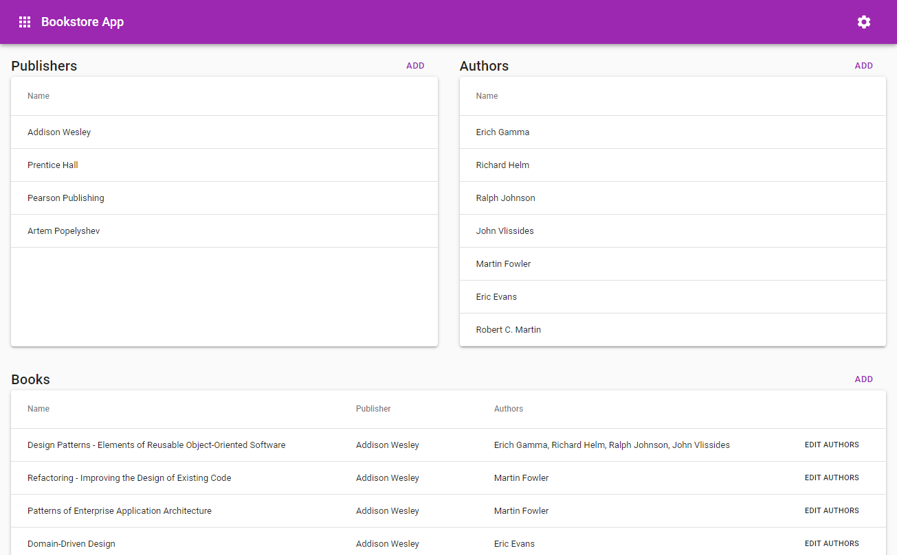

# Bookstore Test App

This a demonstration of a complete web application based on [Apollo](https://www.apollographql.com/) and [React](https://reactjs.org/), utilizing GraphQL for data handling.

## Installation and running

Please first start the `server` (pointing to port 8080) using:

```bash
yarn
yarn build
yarn start
```

and then the `client` (port 3000)

```bash
yarn
yarn start
```


